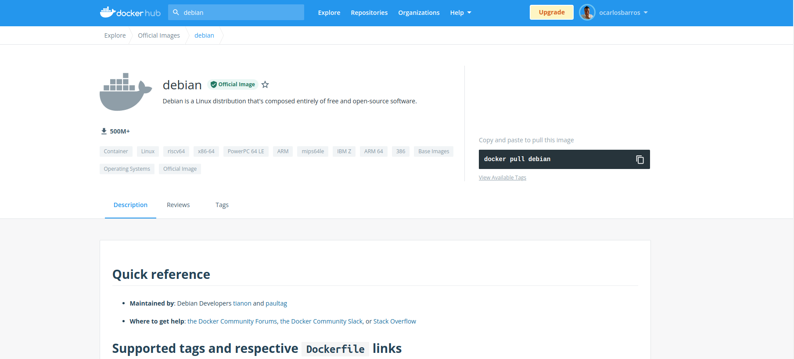

# Introdução Backend

## Utilizando containers Docker

### Resposta do Exercício

1. Imagem Docker Hub
    


2.    ```bash
        docker pull debian
      ```
3.    ```bash
        docker pull:stable-slim
      ```

4.    ```bash
        docker container run -ti debian:stable-slim
      ```

5.    ```bash
      docker container run -ti debian:stable-slim     
        root@50078a9dc2e6:/# cat /etc/*release
        PRETTY_NAME="Debian GNU/Linux 11 (bullseye)"
        NAME="Debian GNU/Linux"
        VERSION_ID="11"
        VERSION="11 (bullseye)"
        VERSION_CODENAME=bullseye
        ID=debian
        HOME_URL="https://www.debian.org/"
        SUPPORT_URL="https://www.debian.org/support"
        BUG_REPORT_URL="https://bugs.debian.org/"
        root@50078a9dc2e6:/# 
      ```

6.    ```bash
      exit
      ```

7.    ```bash
        docker container ls -l
        CONTAINER ID   IMAGE                COMMAND   CREATED         STATUS                          PORTS     NAMES
        50078a9dc2e6   debian:stable-slim   "bash"    3 minutes ago   Exited (0) About a minute ago             goofy_mendeleev
      ```

8.    ```bash
      docker container start 5007
      docker container ls
      CONTAINER ID   IMAGE                COMMAND   CREATED         STATUS          PORTS     NAMES
      50078a9dc2e6   debian:stable-slim   "bash"    6 minutes ago   Up 50 seconds             goofy_mendeleev
      ```

9.    ```bash
      docker exec -it 5007 bash
      ```

10.   ```bash
      docker exec -it 5007 bash
      root@50078a9dc2e6:/# cat /etc/debian_version
      11.2
      ```

11.   ```bash
      exit
      ```

12.   ```bash
      docker container rm -f 5007
      ```

13.   ```bash
       docker container run -it --rm andrius/ascii-patrol 
      ```

14.   ```bash
        ctrl + c
      ```
