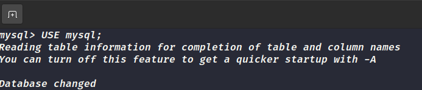
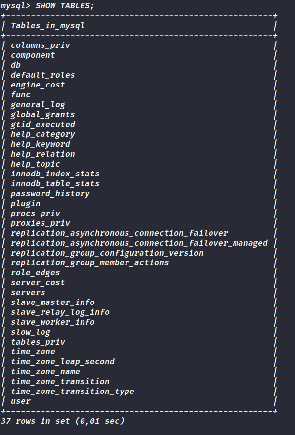
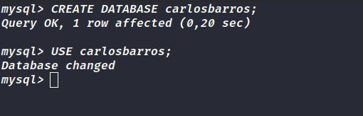

# Vamos Treinar

1. Entre no banco de dados mysql.

2. Visualize todas as tabelas desse banco.

3. Visualize a estrutura de pelo menos 10 tabelas diferentes e tente entender o tipo de estrutura que costuma ser utilizada.

- [X] Feito.

4. Crie um novo banco de dados com o seu nome e depois entre nele!

