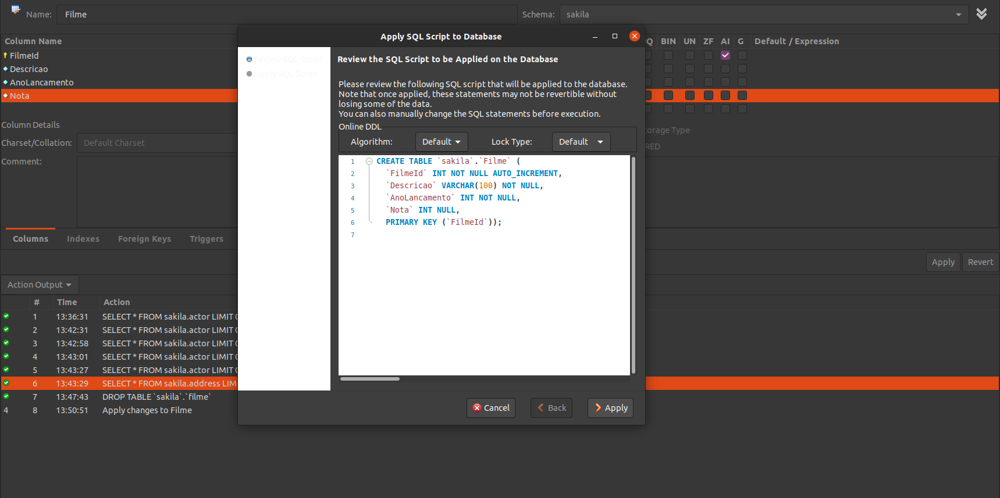

1. Clique em uma tabela, clique no ícone de tabela com um raio. Outra alternativa: Clicar com o botão direito do mouse no nome da tabela e clicar na opção Select Rows -  Limit 1000.
 
2. Clique em Tables no lado esquerdo do Workbench com o botão direito e clique Create Table
 
3. Tabela criada utilizando interface do Workbench.
   

4. Faz referência a tabela country.

5. O Tipo de relacionamento entre a tabela city e country é N:1

6. O Tipo de relacionamento entre a tabela country e city é 1:N

7. Relacionamentos 1:N ou N:1
   Relacionamento N:1 store e staff, film e language e language e film.
